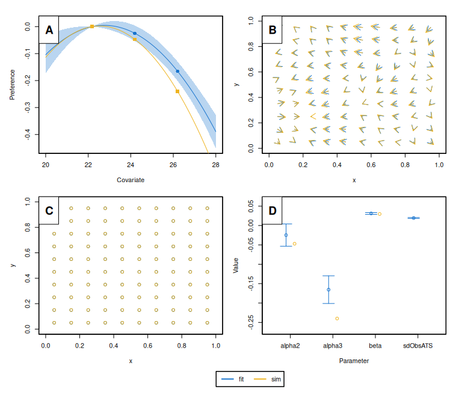

<!-- README.md is generated from README.Rmd. Please edit that file -->
<!-- badges: start -->

[](https://www.gnu.org/licenses/gpl-3.0)
<!-- badges: end -->

*momo* is a new R package for tagging-based *mo*vement *mo*deling,
specifically designed to estimate fine-scale animal movement patterns
using various tagging data, such as mark-recapture, mark-resight, and
data-logging/archival tags. The movement model is based on the
advection-diffusion equation and incorporates habitat preference
functions, enabling the reconstruction of individual movement paths and
inference of population-level movement dynamics using a small set of
interpretable parameters. Movement rates are estimated as a function of
environmental conditions or geographic locations.

## Installation

<div class=".momo-release">

``` r
# install.packages("remotes")
remotes::install_github("tokami/momo")
```

</div>

<div class=".momo-devel">

``` r
remotes::install_github("tokami/momo", ref = "dev")
```

</div>

## Usage

To get started with *momo*, load the package, simulate a tagging
dataset, and fit the movement model:

``` r
library(momo)
#> Loading required package: RTMB

## Simulate a small tagging data set
sim <- sim.momo()
#> Warning in prep.env(env): Something went wrong when trying to conver the date
#> information (3rd dimension) to decimal years. Please check the use of the
#> argument 'date.format' to specify the format of the time dimension!
#> Tags recaptured outside of spatial domain: 3. Removing them.

## Fit momo to the simulated data
fit <- fit.momo(sim)
#> Building the model, that can take a few minutes.
#> Model built (0.65min). Minimizing neg. loglik.
#>   0:    -764.52921:  0.00000  0.00000 -4.60517 -4.60517
#>   1:    -1622.7452: 0.809506 -0.158924 -4.26143 -4.15652
#>   2:    -3852.9454: 0.460597 -0.136380 -3.98798 -3.92635
#>   3:    -4697.4419: 0.0549107 -0.158445 -3.85450 -3.66728
#>   4:    -4754.9426: 0.153769 -0.130276 -3.73661 -3.51863
#>   5:    -4774.9591: 0.0273377 -0.0211933 -3.60556 -3.55739
#>   6:    -4797.3994: 0.130940 -0.0732304 -3.44445 -3.64202
#>   7:    -4799.1280: 0.0799836 -0.267297 -3.48732 -3.57520
#>   8:    -4811.4709: 0.0580559 -0.180328 -3.44624 -3.53151
#>   9:    -4813.7381: 0.0906916 -0.165858 -3.44379 -3.53516
#>  10:    -4815.1586: 0.0736870 -0.158719 -3.41886 -3.55339
#>  11:    -4816.6418: 0.0809782 -0.115713 -3.46543 -3.52017
#>  12:    -4816.9184: 0.0925146 -0.0900967 -3.41286 -3.56044
#>  13:    -4817.5956: 0.0838907 -0.0895346 -3.41309 -3.55842
#>  14:    -4817.7726: 0.0783491 -0.0911288 -3.41440 -3.55179
#>  15:    -4817.8239: 0.0819420 -0.0915767 -3.42057 -3.54653
#>  16:    -4817.8851: 0.0796595 -0.0876647 -3.42814 -3.54749
#>  17:    -4817.9036: 0.0795222 -0.0863060 -3.42808 -3.54425
#>  18:    -4817.9041: 0.0805814 -0.0838177 -3.42965 -3.54264
#>  19:    -4817.9089: 0.0796985 -0.0842348 -3.43111 -3.54271
#>  20:    -4817.9090: 0.0796483 -0.0839999 -3.43091 -3.54288
#>  21:    -4817.9090: 0.0796543 -0.0840143 -3.43104 -3.54291
#>  22:    -4817.9090: 0.0796473 -0.0840087 -3.43100 -3.54288
#>  23:    -4817.9090: 0.0796492 -0.0840076 -3.43099 -3.54288
#> Minimization done (0.017min). Model converged. Estimating uncertainty.

## Plot simulated data and model predictions
plotmomo.compare(sim = sim, fit = fit)
```

<!-- -->

This example illustrates the basic workflow: prepare data (here
simulate), fit the model, and access results. For real applications,
momo supports multiple types of tagging data, customizable environmental
covariates, and both estimation and prediction features.

Detailed examples and guidance are provided in the package vignettes
(see <https://tokami.github.io/momo/>).

## Getting help

You can find more information about *momo* on its *pkgdown* page at
<https://tokami.github.io/momo/>. The page includes links to vignettes,
functions descriptions, version updates, and many more. In case, your
question is not answered on the *pkgdown* webpage, please write an email
to the maintainer: [Tobias
Mildenberger](mailto:t.k.mildenberger@gmail.com). In case you find bugs,
please post an issue on [here](https://github.com/tokami/momo/issues).

## Citation

Please use the R command `citation("momo")` to receive information on
how to cite this package.

## References

1.  Mildenberger, T. K., Maunder, M., Nielsen, A. (in prep). momo: an R
    package for the estimation of fine-scale animal movement based on
    tagging data
2.  Mildenberger, T. K., et al. (in prep). Habitat suitability and
    movement of Skipjack tuna in the Eastern Pacific Ocean
